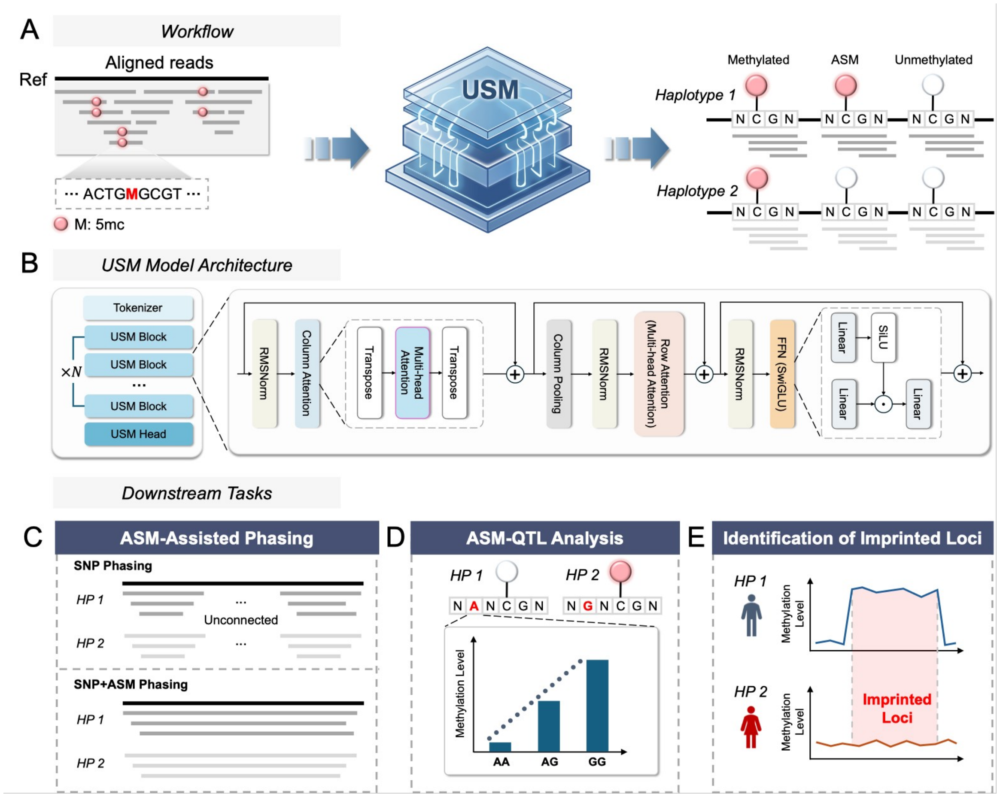

# HaploNet

## HaploNet Enables Allele-Specific DNA Methylation Detection Using Oxford Nanopore Sequencing Data

HaploNet is an **haplotype-aware foundation-model-driven framework** for high-precision site-level DNA methylation inference from Oxford Nanopore (ONT) long reads. By directly integrating haplotype context and phased alignment features into a pretrained USM Transformer architecture, HaploNet performs robust probabilistic inference of CpG methylation states at single-locus resolution — including **methylated**, **unmethylated**, and **allele-specific methylation (ASM)**.

Unlike existing pipelines that rely on post-hoc statistical aggregation of read-level methylation calls, HaploNet jointly models sequence context, cross-read consistency, and haplotype-partitioned signal structure within a unified deep learning framework.

---



*Fig. 1 — Overall framework: (A) Workflow from aligned ONT reads to per-haplotype methylation probabilities; (B) USM Model Architecture with Tokenizer, N×USM Blocks, Multi-head Attention, SwiGLU FFN; (C–E) Downstream tasks: ASM-Assisted Phasing, ASM-QTL Analysis, Identification of Imprinted Loci.*

---

- [HaploNet](#haplonet)
  - [Overview](#overview)
  - [Framework & Architecture](#framework--architecture)
- [System requirements](#system-requirements)
  - [Hardware requirements](#hardware-requirements)
  - [Software requirements](#software-requirements)
    - [OS requirements](#os-requirements)
    - [Python dependencies](#python-dependencies)
    - [Phasing tools](#phasing-tools)
- [Data Availability](#data-availability)
- [Data sources & preprocessing pipeline](#data-sources--preprocessing-pipeline)
  - [ONT sequencing data](#ont-sequencing-data-giab-samples-hg001--hg005)
  - [Short-read methylation ground truth (EpiQC / SEQC2)](#short-read-methylation-ground-truth-epiqc--seqc2)
  - [Phasing benchmark (GIAB v4.2.1)](#phasing-benchmark-giab-v421)
  - [Population-scale cohort (1000 Genomes Project ONT)](#population-scale-cohort-1000-genomes-project-ont)
  - [Reference genome & annotations](#reference-genome--annotations)
  - [Preprocessing: from raw FASTQ to phased BAM](#preprocessing-from-raw-fastq-to-phased-bam)
  - [Input BAM requirements](#input-bam-requirements)
- [Install guide](#install-guide)
  - [1. Configure the environment](#1-configure-the-environment)
  - [2. Download model weights and test data](#2-download-model-weights-and-test-data)
  - [3. Verify installation](#3-verify-installation)
- [Run inference](#run-inference)
  - [Mode A — ASM Detection & Phasing](#mode-a--asm-detection--phasing)
  - [Mode B — 3-Class Classification](#mode-b--3-class-classification)
- [Disclaimer](#disclaimer)
- [Copyright](#copyright)

---

## Overview

HaploNet addresses a fundamental limitation of conventional long-read methylation analysis pipelines: **post-hoc aggregation cannot correct systematic errors introduced upstream** in read-level methylation calling or haplotype assignment. By incorporating phased alignment features directly into the inference model, HaploNet learns methylation-state boundaries jointly from local haplotype-resolved context.

**Two complementary inference modes:**

| Mode | Task | Input | Output |
|------|------|-------|--------|
| **A — ASM Detection** | Haplotype-phased binary methylation classification | Per-haplotype MSA tensors (HP=1 / HP=2) | Site-level methylated/unmethylated probabilities per haplotype → ASM calls + phased VCF |
| **B — 3-Class Classification** | Genome-wide 3-class methylation state prediction | Aggregated MSA tensor (all reads) | Unmethylated / fully methylated / intermediate (ASM) per locus |

---

## Framework & Architecture

### USM Backbone

| Component | Detail |
|-----------|--------|
| Parameters | 30M |
| Embedding dim | 768 (hidden)|
| Layers | 12 stacked transformer blocks |
| Attention heads | 12 multi-head attention |
| MSA input size | 200 reads × 11 bp window |
| Feature channels | 7 (base identity, insertion, strand, HP state, base quality, map quality, base counts) |
| Positional encoding | Rotary Position Embedding (RoPE) |
| Attention | Column-wise (cross-read) + Row-wise (positional) SDPA |
| FFN | SwiGLU activation|
| Normalization | RMSNorm (pre-layer norm) |
| Classification head | Dense → Tanh → Dropout → Linear |

### Input representation: Multiple Sequence Alignment (MSA)

For each candidate CpG locus, HaploNet constructs a **2D read-by-position MSA tensor**:

1. **Genomic window**: Fixed-length window centered on the target CpG (5 bp padding = 11 bp total)
2. **Read collection**: All overlapping reads from the phased BAM (secondary/supplementary/low-MAPQ filtered; depth capped at 200 reads with random subsampling or zero-padding)
3. **Reference anchor**: Row 0 is always the reference sequence; subsequent rows are aligned reads ordered by genomic coordinate
4. **5mC encoding**: Cytosines satisfying the integer modification-likelihood cutoff `ML > 127` are encoded as `M` before tokenization; strand-aware CpG handling (forward: cytosine position; reverse: shifted to adjacent G position)

### Feature channels (7 tracks)

| # | Channel | Type | Description |
|---|---------|------|-------------|
| 1 | Base identity | Discrete | Extended alphabet: A/C/G/T/N/M/D/I (+ lowercase for reverse strand); M = 5mC, D = deletion, I = insertion anchor |
| 2 | Insertion sequence | Discrete | Inserted bases at each position (same alphabet, preserves content without expanding grid) |
| 3 | Strand orientation | Discrete | Categorical: 1 = forward, 2 = reverse, 0 = padded/unmapped |
| 4 | Haplotype state | Discrete | From WhatsHap HP tags: 1 = HP1, 2 = HP2, 0 = unphased |
| 5 | Base quality | Continuous | Phred-scaled, linearly normalized (/100) |
| 6 | Mapping quality | Continuous | MAPQ, normalized (/100) |
| 7 | Base counts | Continuous | Per-column read count profile |

### Key Design Principles

1. **Pretrained USM prior** — Masked token reconstruction pretraining on whole-genome read pileups provides sequence- and alignment-level representations before task-specific fine-tuning
2. **2D read-by-position modeling** — Each locus is modeled as a joint structure enabling simultaneous depth-wise methylation variation and local sequence context analysis
3. **Multi-channel feature integration** — All 7 tracks share identical spatial indexing and are fused before Transformer processing
4. **Haplotype-aware training strategy** — Models learn from high-confidence fully methylated/unmethylated loci (derived from 6-method short-read consensus); ASMs are inferred as polarized relationships between paired haplotypes at inference time

---

# System requirements

## Hardware requirements

HaploNet supports CPU and GPU inference. CPU execution is suitable for small-region functional testing, whereas a compatible NVIDIA GPU is recommended for large-scale inference.

GPU and host-memory requirements depend on the checkpoint, MSA dimensions, batch size, numerical precision, and number of preprocessing workers. Reduce the inference batch size and preprocessing parallelism when memory is limited.

The `--cpu` option controls HaploNet inference only; upstream tools have their own hardware requirements.

## Software requirements

### OS requirements

Tested on Linux:
+ CentOS Linux release 8.2.2004
+ Ubuntu 18.04.5 LTS / 20.04 LTS

### Python dependencies

```
python>=3.9,<3.12
torch>=2.0
pysam>=0.22
numpy
tqdm
intervaltree
whatshap==2.8
```
+ Full dependency lockfile: `environment.yml`

### Phasing tools (required for Mode A post-processing)

| Tool | Version | Purpose | Install |
|------|---------|---------|--------|
| [whatshap](https://github.com/whatshap/whatshap) | ==2.8 | Phasing, haplotagging, comparison | `pip install whatshap==2.8` |
| [longphase](https://github.com/tianyunan/longphase) | v1.7.3 | Long-read-aware joint SNP+methylation phasing | Download binary from [Releases](https://github.com/tianyunan/longphase/releases) |
| bcftools | >=1.17 | VCF processing (bgzip, tabix, concat) | `sudo apt-get install bcftools tabix` (Ubuntu/Debian) or `yum install bcftools` (CentOS/RHEL) |
| samtools | >=1.17 | BAM indexing, processing | Installed alongside bcftools |

---

# Data Availability

> **All raw sequencing datasets analyzed in this study are publicly available.**
>
> Short-read methylation reference data for HG001–HG005 were obtained from the SEQC2 Epigenomics Quality Control (EpiQC) study[^41], available from Gene Expression Omnibus (GEO) under accession number **[GSE186383](https://www.ncbi.nlm.nih.gov/geo/query/acc.cgi?acc=GSE186383)**.
>
> Oxford Nanopore whole-genome sequencing data for GIAB samples HG001–HG005 were obtained from the Genome in a Bottle Data Release **[2025.01](https://epi2me.nanoporetech.com/giab-2025.01/)** resource, with data hosted in the public Amazon S3 bucket at `s3://ont-open-data/giab_2025.01/`.
>
> For phasing accuracy evaluation in HG002, the trio-phased benchmark truth set was obtained from the NIST/Genome in a Bottle (GIAB) **v4.2.1 GRCh38** benchmark release, specifically the phased benchmark VCF available at:
> `https://ftp-trace.ncbi.nlm.nih.gov/giab/ftp/release/AshkenazimTrio/HG002_NA24385_son/NISTv4.2.1/GRCh38/SupplementaryFiles/HG002_GRCh38_1_22_v4.2.1_benchmark_phased_MHCassembly_StrandSeqANDTrio.vcf.gz`
>
> For population-scale ASM-QTL analysis, Oxford Nanopore sequencing data were obtained from the **1000 Genomes Project ONT** resource: [https://s3.amazonaws.com/1000g-ont/index.html](https://s3.amazonaws.com/1000g-ont/index.html).
>
> CpG island annotations were obtained from the **UCSC Genome Browser**, and gene annotations were obtained from **GENCODE release v43**: https://www.gencodegenes.org/human/release_43.html

---

# Data sources & preprocessing pipeline

## ONT sequencing data (GIAB samples HG001–HG005)

| Item | Detail | Source |
|------|--------|--------|
| Platform | Oxford Nanopore PromethION R10.4.1 flow cells | |
| Samples | GIAB reference: HG001, HG002, HG003, HG004, HG005 | |
| Coverage | ~35–40× per genome (single flow cell) | |
| Access | **GIAB Data Release 2025.01** | https://epi2me.nanoporetech.com/giab-2025.01/ |
| Direct download | Amazon S3 (free) | `s3://ont-open-data/giab_2025.01/` |

> We restricted analysis to one flow cell per genome (~40×) to approximate real-world scenarios.

### Short-read methylation ground truth (EpiQC / SEQC2)

| Item | Detail | Source |
|------|--------|--------|
| Study | SEQC2 Epigenomics Quality Control (EpiQC) consortium | |
| Methods | 6 independent library preps: WGBS (TruSeq, MethylSeq, SPLAT, TrueMethylBS), oxBS (TrueMethylOX), EM-seq | |
| Samples | HG001–HG005 (2 biological replicates each) | |
| Accession | **GEO GSE186383** | https://www.ncbi.nlm.nih.gov/geo/query/acc.cgi?acc=GSE186383 |

> Methylation labels were derived by averaging β-values across all 6 methods. Loci with coverage > 10× in all 6 methods were retained. Fully methylated: mean β > 0.9; fully unmethylated: mean β < 0.1.

### Phasing benchmark (GIAB v4.2.1)

| Item | Detail | Source |
|------|--------|--------|
| Benchmark | NIST/GIAB v4.2.1 GRCh38 phased benchmark | |
| Sample | HG002 (AshkenazimTrio son) | |
| File | Phased benchmark VCF (with MHC assembly, StrandSeq + Trio) | https://ftp-trace.ncbi.nlm.nih.gov/giab/ftp/release/AshkenazimTrio/HG002_NA24385_son/NISTv4.2.1/GRCh38/SupplementaryFiles/HG002_GRCh38_1_22_v4.2.1_benchmark_phased_MHCassembly_StrandSeqANDTrio.vcf.gz |

### Population-scale cohort (1000 Genomes Project ONT)

| Item | Detail | Source |
|------|--------|--------|
| Cohort | 1000 Genomes Project ONT resource | |
| Filter | R10.4.1 chemistry only (R9 excluded) | |
| Release | "100_Plus" data release (see Supplementary Table 2) | https://s3.amazonaws.com/1000g-ont/index.html |

### Reference genome & annotations

| Item | Version | Source |
|------|---------|--------|
| Reference genome | GRCh38 (no alt analysis set) | GENCODE / NCBI |
| Gene annotation | GENCODE release v43 | https://www.gencodegenes.org/human/release_43.html |
| CpG island annotation | UCSC Genome Browser | UCSC Table Browser / UCSC API |

## Preprocessing: from raw ONT signal to haplotagged BAM

The following pipeline converts raw ONT signal data into the phased BAM format required by HaploNet. This is the exact preprocessing used in our paper.

```
┌─────────────┐     ┌──────────────┐     ┌────────────┐     ┌───────────┐     ┌────────────┐
│  Raw ONT    │ ──► │  Dorado v0.8 │ ──► │  Minimap2  │ ──► │  Clair3   │ ──► │ WhatsHap   │
│  pod5/fast5 │     │ basecalling  │     │ alignment  │     │ SNP+indel │     │ phasing    │
│             │     │ + 5mC calling│     │ (GRCh38)   │     │ calling   │     │ (HP/PS tag)│
└─────────────┘     └──────────────┘     └────────────┘     └───────────┘     └────────────┘
                                            │                   │                  │
                                            ▼                   ▼                  ▼
                                      BAM (MM/ML)         SNP VCF           Phased BAM
                                      (methylation       (high-conf        (MM/ML/HP/PS)
                                       tags added)          variants)
```

### Step 1: Basecalling with Dorado (includes 5mC detection)

```bash
# Install dorado (via conda or docker)
# Conda:
conda install -c bioconda dorado -c conda-forge

# Run basecalling with modified-base calling enabled
dorado basecaller \
  dna_r10.4.1_e8.2_400bps_sup@v4.3.0 \
  /path/to/pod5_dir/ \
  --modified-bases 5mC_5hmC \
  --reference /path/to/GCA_000001405.15_GRCh38_no_alt_analysis_set.fna \
  -o output.bam
```

**Key parameters:**
- Model: `dna_r10.4.1_e8.2_400bps_sup@v4.3.0` (R10.4.1 super-accurate model)
- `--modified-bases 5mC_5hmC`: Enables concurrent 5-methylcytosine detection (produces MM/ML tags)
- The output BAM contains per-base modification probabilities in standard SAM/BAM `MM` (modification string) and `ML` (probability) tags

### Step 2: Alignment to reference genome

```bash
dorado aligner \
  GCA_000001405.15_GRCh38_no_alt_analysis_set.fna \
  basecalled.unaligned.bam \
  --mm2-opts "-x map-ont" \
  | samtools sort -@ "$THREADS" -o aligned.bam -
samtools sort -@ 16 -o aligned.bam -

# Index
samtools index aligned.bam
```

### Step 3: Small variant calling (SNP + indel)

```bash
# Call SNPs and indels with Clair3
CLAIR3_OUT="$(pwd)/clair3_output"

run_clair3.sh \
  --bam_fn="$(pwd)/aligned.bam" \
  --ref_fn="$REF" \
  --threads="$THREADS" \
  --platform=ont \
  --model_path="$CLAIR3_MODEL" \
  --sample_name="$SAMPLE" \
  --output="$CLAIR3_OUT"

# Extract high-confidence heterozygous SNPs
bcftools view \
  -f PASS \
  -m2 -M2 \
  -v snps \
  -g het \
  "$CLAIR3_OUT/merge_output.vcf.gz" \
  -Oz -o snp.vcf.gz

tabix -f -p vcf snp.vcf.gz
```

Output: `clair3_output/snp.vcf.gz` (high-confidence SNP and indel calls).

### Step 4: Haplotype phasing (WhatsHap)

```bash
# Phase SNPs using ONT reads

whatshap phase \
  --reference "$REF" \
  --ignore-read-groups \
  --sample "$SAMPLE" \
  --output phased_het.vcf.gz \
  snp.vcf.gz \
  aligned.bam

# Index phased VCF
tabix -f -p vcf phased_het.vcf.gz

# Assign haplotype tags to reads
whatshap haplotag \
  --reference "$REF" \
  --ignore-read-groups \
  --sample "$SAMPLE" \
  --output phased.haplotag.bam \
  phased_het.vcf.gz \
  aligned.bam

# Index final BAM
samtools index phased.haplotag.bam
```

The resulting `phased.haplotag.bam` contains all required tags:
| Tag | Meaning | Required |
|-----|---------|----------|
| `MM` | Modification string (e.g., `C+m?`) | Yes |
| `ML` | Per-base modification probability (0–255) | Yes |
| `HP` | Haplotype assignment (1 or 2) | Yes |
| `PS` | Phase set ID | For phasing evaluation only |

## Input BAM requirements

To run HaploNet inference, your BAM file must satisfy:

- [x] **Format**: Sorted, indexed BAM (`*.bai` present), coordinate-sorted
- [x] **Methylation tags**: `MM` and `ML` tags on every read (from Dorado modified-base calling)
- [x] **Haplotype tags**: `HP` tag (1 or 2) on each read (from WhatsHap haplotagging)
- [x] **Reference genome**: GRCh38 (the model was trained on GRCh38 coordinates)
- [x] **Chemistry**: R10.4.1 pore data (model weights are chemistry-specific)

> **If you have your own ONT data**: Follow the preprocessing pipeline above (Steps 1–4) to generate a compatible phased BAM. The demo data provided in `weight/` has already been preprocessed and can be used directly.

---

# Install guide

## 1. Configure the environment

```bash
git clone https://github.com/TencentAILabHealthcare/HaploNet.git
cd HaploNet

# Create conda environment
conda env create -n haplonet -f environment.yml
conda activate haplonet

# System dependencies (for VCF post-processing):
# Ubuntu/Debian: sudo apt-get install bcftools samtools tabix
# CentOS/RHEL:  yum install bcftools samtools
```

Verify Python environment:

```bash
python -c "import torch; print(f'PyTorch {torch.__version__}, CUDA available: {torch.cuda.is_available()}')"
python -c "import pysam; print(f'pysam {pysam.__version__}')"
```

## 2. Download model weights and test data

> **Model weights are NOT included in the repository due to file size limits.**
> You **must** download them before running inference.

All required files (model weights + demo data + reference genome) are packaged as a single archive:

| Item | Link | Contents |
|------|------|----------|
| **Model weights + Demo data** | [Baidu Netdisk](https://pan.baidu.com/s/1b9Ev9Ux18zENpY7PKTnwow) (extraction code: `ntj3`) | See table below |

Download and extract into the project root (`weight/` directory):

```bash
cd HaploNet/

# === Step 1: Download from Baidu Netdisk ===
# Visit: https://pan.baidu.com/s/1b9Ev9Ux18zENpY7PKTnwow
# Code: ntj3

# === Step 2: Extract to project root ===
unzip HaploNet_weights.zip -d ./
# Or if downloaded as tar:
tar xzf HaploNet_weights.tar.gz -C ./

# === Step 3: Verify ===
ls weight/*.pt weight/*.fna
# Expected: complete.pt, haplotype.pt, pretrain.pt, GCA_000001405...fna
```

### Expected `weight/` directory contents

After extraction, verify that `weight/` contains the following files:

| File | Size (approx.) | Required for | Description |
|------|----------------|-------------|-------------|
| `haplotype.pt` | ~120 MB | **Mode A** | 2-class model weights (methylated / unmethylated, per-haplotype) |
| `complete.pt` | ~120 MB | **Mode B** | 3-class model weights (unmethylated / methylated / ASM) |
| `pretrain.pt` | ~120 MB | Training | Pretrained USM backbone weights (masked token reconstruction) |
| `phased.haplotag.bam` | ~10+ GB | **Demo input** | Phased ONT BAM (HG002, MM/ML/HP tags included) |
| `phased.haplotag.bam.bai` | < 10 MB | **Demo input** | BAM index |
| `GCA_000001405.15_GRCh38_no_alt_analysis_set.fna` | ~3.0 GB | **Both modes** | Human reference genome (GRCh38, no alt contigs) |
| `GCA_000001405.15_GRCh38_no_alt_analysis_set.fna.fai` | < 1 MB | **Both modes** | FASTA index |
| `snp.vcf.gz` | ~80 MB | Mode A phasing | High-confidence SNP VCF (Clair3 calls, for LongPhase) |
| `HG002_GRCh38_...benchmark_phased....vcf.gz` | ~155 MB | Evaluation | GIAB v4.2.1 trio-phased benchmark truth (for phasing accuracy eval) |
| `HG002_gt_labels.jsonl` | ~3.6 GB | **Mode B eval** | Ground-truth methylation labels (per-CpG, 3-class) |
| `HG002_methy_labels.csv` | ~varies | Evaluation | Alternative GT label format (CSV) |

### Quick verification

```bash
ls -lh weight/
# Expected output should show all files above with non-zero sizes
```

> **Minimum files to run inference** (without evaluation/phasing): `haplotype.pt` or `complete.pt`, `*.fna`, `*.fai`, `phased.haplotag.bam`, `phased.haplotag.bam.bai`
>
> **For full pipeline** (including LongPhase phasing): also need `snp.vcf.gz`
>
> **For accuracy evaluation**: additionally need `HG002_gt_labels.jsonl` and/or benchmark VCF

## 3. Verify installation

Run the built-in sanity check:

```bash
cd demo/haplo_infer
python infer_demo.py --region chr1:68050000-68050500 --cpu --skip-check 2>&1 | head -20
```

Expected: The script starts loading model weights and building MSA without import/path errors.

---

# Run inference

## Mode A — ASM Detection & Phasing

Performs **per-haplotype binary methylation classification**, identifies **ASM sites**, and optionally runs **LongPhase joint SNP+methylation phasing**.

### Quick start (demo region)

```bash
cd demo/haplo_infer

# CPU mode (recommended for testing)
python infer_demo.py --region chr1:68050000-68050500 --cpu --skip-check

# GPU mode (faster for large regions)
python infer_demo.py --region chr1:68050000-68050500 --skip-check

# Full pipeline with shell wrapper (includes VCF generation + LongPhase phasing + metrics)
./infer.sh
```

### Command-line arguments (infer_demo.py)

| Argument | Default | Description |
|----------|---------|-------------|
| `--bam` | `../weight/phased.haplotag.bam` | Input phased BAM path |
| `--ref` | `../weight/GCA_000001405...fna` | Reference genome FASTA |
| `--region` | _required_ | Genomic region (e.g., `chr1:68050000-68050500`) |
| `--sample-name` | `HG002` | Sample identifier |
| `--output-dir` | `./store/` | Output directory |
| `--weights` | `../weight/haplotype.pt` | Path to Mode A model weights |
| `--padding` | `5` | MSA half-window size in bp (total window = 2*padding+1) |
| `--min-depth` | `4` | Minimum read depth per site |
| `--batch-size` | `512` | Inference batch size |
| `--gpu-count` | `1` | Number of GPUs (0 for CPU) |
| `--cpu` | _flag_ | Force CPU inference |
| `--skip-check` | _flag_ | Skip pre-flight file checks |

### Pipeline stages (infer.sh)

The shell wrapper `./infer.sh` runs the complete end-to-end pipeline:

| Step | Action | Output |
|------|--------|--------|
| 1 | Model Inference (MSA build + forward pass) | `inference/*methy_class.csv` |
| 2 | ASM Filtering (discordant sites) | `vcf/*_asm_filtered.csv` |
| 3 | CSV → VCF conversion | `vcf/*_raw_mod.vcf.gz` |
| 4 | Graph Consistency Filter (LongPhase-style pruning) | `graph_filtered/filtered.vcf.gz` |
| 5 | Ratio Filter (haplotype depth balance) | `graph_filtered/ratio_filtered.vcf.gz` |
| 6 | LongPhase Phasing (joint SNP+mod) | `longphase/*.vcf.gz` |
| 7 | Metrics (N50, block stats, whatshap compare) | `metrics/*.txt`, `summary.json` |

### Output

Results are saved to `store/infer_{region}_{timestamp}/` (or `demo_output/` when using `infer.sh`):

| File | Description |
|------|-------------|
| `vcf/graph_filtered/ratio_filtered.vcf.gz` | Final filtered mod VCF variant calls (ASM sites) |
| `vcf/{sample}_phased.vcf.gz` | Phased VCF with PS tags (requires `snp.vcf.gz`) |
| `longphase/{sample}_phased.vcf.gz` | LongPhase joint-phased VCF (SNP + mod combined) |
| `summary.json` | Phase block statistics (N50, N90, block count, switch error) |

### Example: whole-chromosome inference

```bash
# Infer entire chr1 (takes longer, uses more memory)
python infer_demo.py --region chr1 --cpu --skip-check

# With custom parameters
python infer_demo.py --region chr1 --padding 5 --min-depth 4 --batch-size 1024 --skip-check
```

---

### Mode B — 3-Class Classification

Performs **three-class** (unmethylated / fully methylated / intermediate) site-level classification across all CpG loci.

### Quick start (demo chromosome)

```bash
cd demo/complete

# CPU mode — run on chr1
python infer_demo.py --contig chr1 --cpu --skip-check

# GPU mode
python infer_demo.py --contig chr1 --skip-check

# Full pipeline with shell wrapper (includes GT evaluation)
./infer.sh
# or: ./infer.sh HG002 chr1
```

### Command-line arguments (infer_demo.py)

| Argument | Default | Description |
|----------|---------|-------------|
| `--bam` | `../weight/phased.haplotag.bam` | Input phased BAM path |
| `--ref` | `../weight/GCA_000001405...fna` | Reference genome FASTA |
| `--contig` | _required_ | Chromosome name (e.g., `chr1`) |
| `--sample` | `HG002` | Sample identifier |
| `--output-dir` | `./store/` | Output directory |
| `--weights` | `../weight/complete.pt` | Path to Mode B model weights |
| `--padding` | `5` | MSA half-window size (larger than Mode A!) |
| `--min-depth` | `8` | Minimum read depth (stricter than Mode A) |
| `--batch-size` | `1600` | Inference batch size |
| `--num-procs` | `8` | Parallel processes for MSA construction |
| `--cpu` | _flag_ | Force CPU inference |
| `--skip-check` | _flag_ | Skip pre-flight file checks |

### Output

Results are saved to `store/complete_{contig}_{timestamp}/`:

| File | Description |
|------|-------------|
| `inference/predictions.csv` | Per-CpG predictions: chrom, pos, class, prob(0/1/2), depth |
| `evaluation/eval_report.txt` | Accuracy, precision, recall, F1 (if GT labels provided) |
| `summary.json` | Run config, timing, sample stats |

> **GPU inference:** Remove the `--cpu` flag to use GPU (default). Whole-genome 3-class inference benefits significantly from GPU acceleration.

---

# Copyright
This tool is developed by Tencent AI for Life Sciences Lab.

The copyright holder for this project is AI for Life Sciences Lab, Tencent.
All rights reserved.
